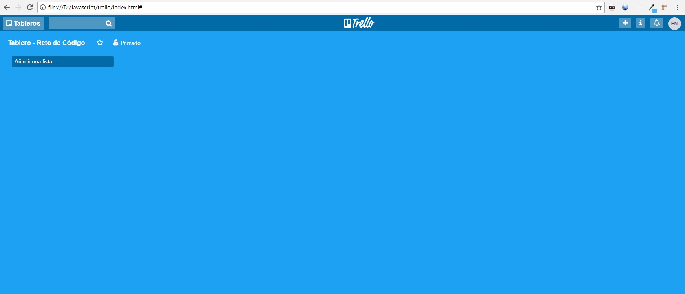
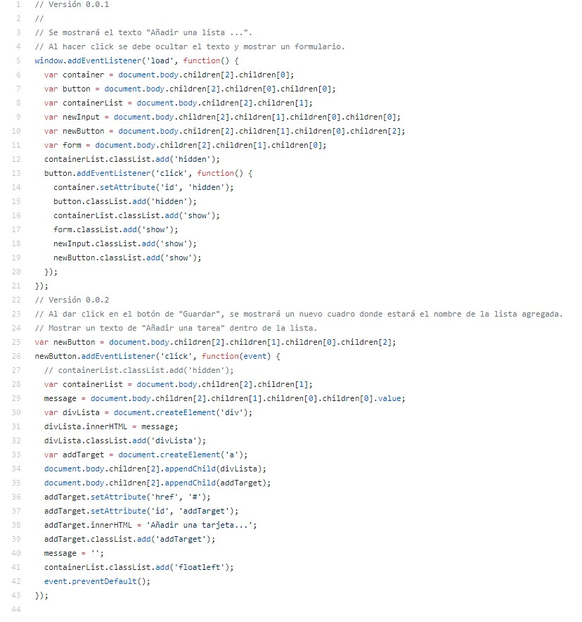

# Reto Trello

Este proyecto consiste en replicar el newsfeed de Trello y para completar este reto, hemos creado este repositorio compuesto de la siguiente manera:
* **assets:** _Carpeta en la que se encontraran las siguientes subcarpetas_
  * **iconos:** _Carpeta en la que se encuentran los iconos usados en este proyecto_
  * **images:** _Carpeta en la que se encuentra todas las imagenes usadas en este proyecto_
* **css:** _Carpeta donde se encuentra nuestra hoja de estilos llamada main.css_
* **js:** _Carpeta donde se encuentra la programacion que utilizaremos llamado app.js_  
* **index.html**
* **README.md**

## Objetivo
El reto consiste en replicar replicar el newsfeed de Trello

**Versión 0.0.1**
* Se mostrará el texto "Añadir una lista ...".
* Al hacer click se debe ocultar el texto y mostrar un formulario.
* El formulario está conformado por un input y un botón para que pueda añadir tareas a tu lista.

**Versión 0.0.2**
* Al dar click en el botón de "Guardar", se mostrará un nuevo cuadro donde estará el nombre de la lista agregada.
* Mostrar un texto de "Añadir una tarea" dentro de la lista.

**Versión 0.0.3**
* Al dar click en "Añadir una tarea", deberá mostrar un formulario con un textarea y un botón que diga "Añadir".

**Versión 0.0.4**
* Poner focus al input al dar click en "Agregar nueva tarea".
* Al dar click en el botón de "Añadir", deberá aparecer el texto de la tarea debajo del título de la lista.

**Versión 0.0.5**
* Mostrar el formulario nuevamente debajo de la última tarea añadida.

**Versión 0.0.6**
* Poder agregar múltiples listas con tarjetas. Para esto, el formulario de "Añadir una lista" debe aparecer a la derecha de la lista anteriormente creada.

## Pseudocodigo

